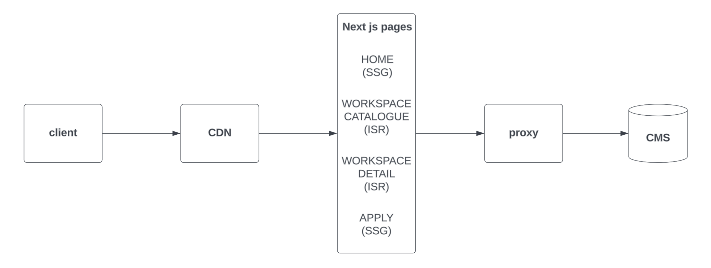

## System context diagram

All public traffic is served from CDN-cached static assets, content are fetched from CMS for updates during build time or ISR.

## Route rendering strategy map

Home

Workspace

Workspace detail

Application

## Sequence diagrams for critical pages

## Data & cache flow diagram

## Component boundary diagram

## Failure mode table