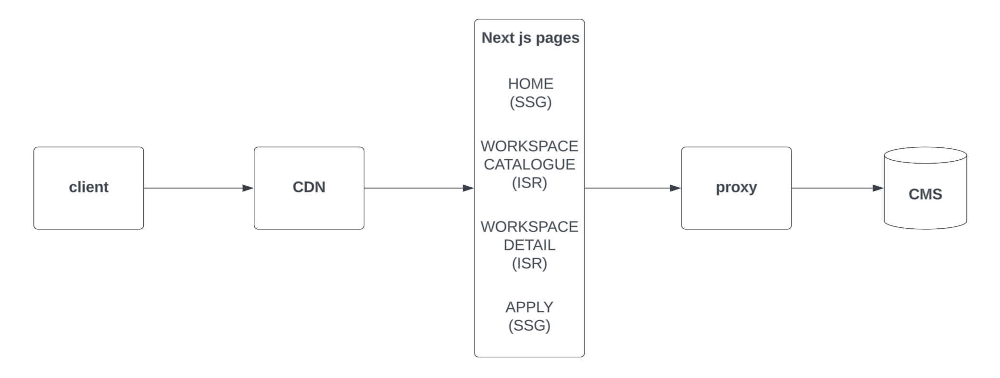
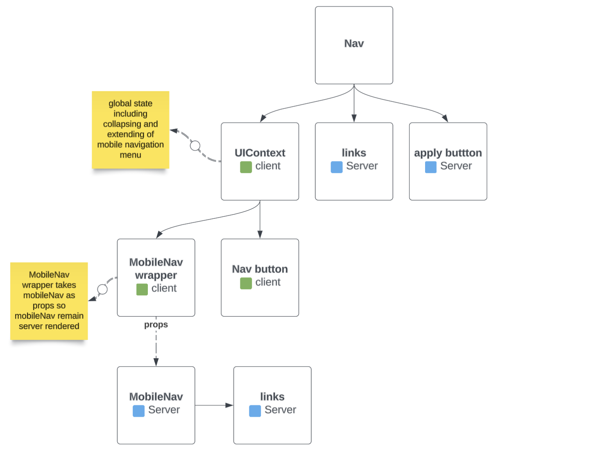
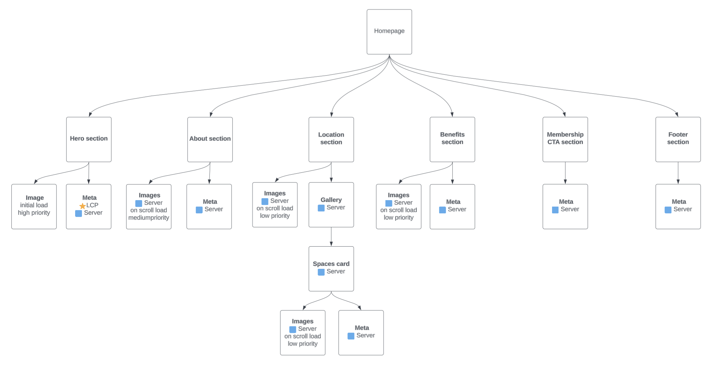

## System context diagram

All public traffic is served from CDN-cached static assets, content are fetched from CMS for updates during build time or ISR.

## Component rendering and delivery diagram

The diagrams visualizes how each component on a page is rendered and delivered to the client. It highlights:

- Critical LCP components – the elements that determine Largest Contentful Paint.
- Loading strategies – whether a component is loaded eagerly, lazily, or dynamically.
- Fetch priority – which resources are prioritized to ensure fast visual completion.
- Rendering mode – distinction between server-rendered and client-rendered components.

The chosen strategies for each component are carefully optimized to minimize render-blocking resources, reduce hydration costs, and improve perceived and actual performance.

The diagrams allow immmediate visibility of performance-critical components, component structure, and how delivery sequence align with peformance goals.

### Navigation menu

### Home page

## Sequence diagrams for critical pages

## Data & cache flow diagram

## Failure mode table